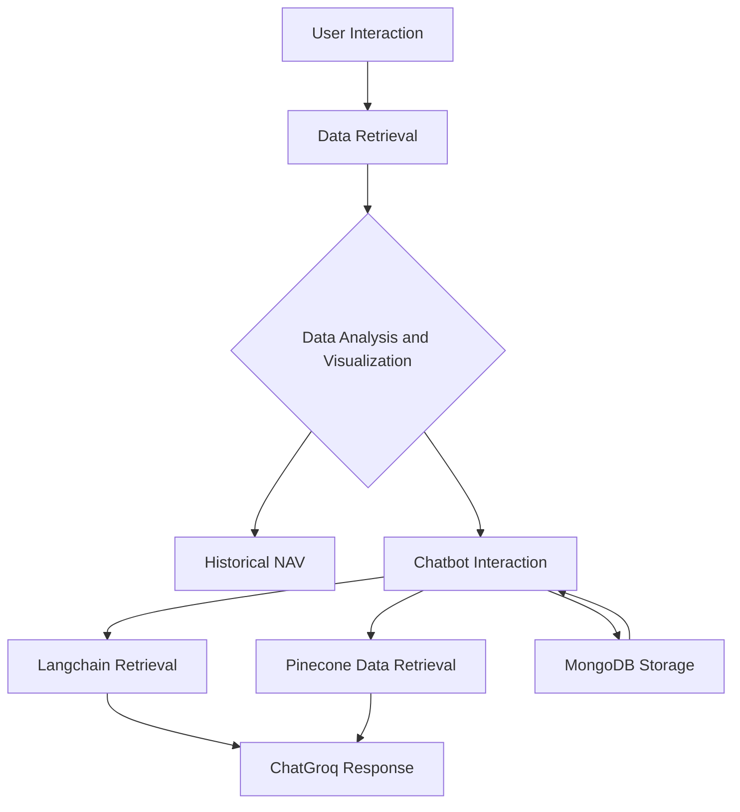

# Mutual Fund Advisory Chatbot Application

**Developer**: Nishkka Upadhyaya  
**Deployment**: The app won’t deploy on Streamlit because Streamlit Cloud forces Python 3.13, which is incompatible with the mftool package. <br>


## Objective
An interactive chatbot providing mutual fund advice with real-time data, personalized responses, and visualizations.
## Tech stack
<p align="center">
  
  
  
  
  
  
  
</p>

---

## Key Features

1. **Real-Time Mutual Fund Data Retrieval**:  
   Using `Mftool`, the app fetches updated and accurate information on mutual funds, including NAVs, scheme details, and fund performance.

2. **Personalized Guidance with Conversational AI**:  
   Powered by a Retrieval-Augmented Generation (RAG) model using `Langchain` for data retrieval and `ChatGroq` for generating context-aware responses.

3. **Vector Storage and Retrieval**:  
   `Pinecone` stores data embeddings, allowing for efficient similarity searches and quick retrieval of relevant information.

4. **Contextual Conversations**:  
   User chat history is stored using `MongoDB` to maintain context for personalized responses, with TTL indexing for automatic data expiry.

5. **Data Visualization**:  
   Users can view historical NAV data through interactive visualizations using `Plotly`.

---
## Architecture




Here is the **shortest possible version** for your README:

---

## Secrets Configuration

Create a file:

```
.streamlit/secrets.toml
```

Add the following keys exactly as shown:

```toml
PINECONE_API = "<your_pinecone_api_key>"
MONGODB_CONNECTION_STRING = "<your_mongodb_connection_uri>"
GROQ_API_KEY = "<your_groq_api_key>"
```

---


